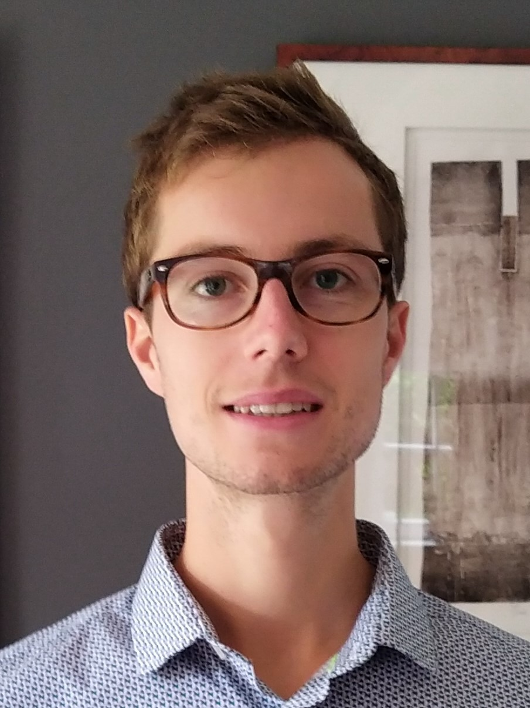

+++
title = "Guillaume Berger"
subtitle = "FNRS Postdoctoral Researcher at UCLouvain"
+++

<!-- @def tags = ["syntax", "code"] -->

@@squeeze
# Guillaume Berger
@@

Postdoctoral Researcher\
Department of Applied Mathematics, UCLouvain\
FNRS Fellow

## About

<!-- raw html to allow a responsive row  -->
~~~

    
~~~

Guillaume Berger is a postdoctoral researcher at [UCLouvain](https://uclouvain.be/en/index.html) in the team of [Raphaël Jungers](https://perso.uclouvain.be/raphael.jungers/content/home), since 2023.
He is funded by an [FNRS](https://www.frs-fnrs.be/en/) postdoctoral research fellowship.
Previously, he was a postdoctoral researcher at the [University of Colorado Boulder](https://www.colorado.edu/) in the team of [Sriram Sankaranarayanan](https://home.cs.colorado.edu/~srirams/).
He obtained his Ph.D. in the study of cyber-physical systems from UCLouvain, supervised by Raphaël Jungers, in 2021.
He obtained his master degree in mathematical engineering from UCLouvain in 2017.

His area of research is the analysis, control, and optimization of complex systems, like cyber-physical systems and hybrid systems.
He is particularly interested in formal verification and data-driven analysis of these systems, using tools from optimization, computer science, and machine learning.

He thaught several undergraduate, master, and graduate level courses at the University of Colorado Boulder, at UCLouvain, and at UNamur.
He also mentored and co-supervised several Ph.D. students.
~~~

~~~

<!-- \tableofcontents you can use \toc as well -->

## Contact

\
My office is the A.026 in the Euler building\
Department of Applied Mathematics\
Avenue Georges Lemaître 4-6/L4.05.01\
1348 Louvain-la-Neuve, Brabant Wallon, Belgium

## News

* I will be at CDC, Rio de Janeiro, Brazil, in December 2025.
* I will be at HSCC, Irvine, California, in May 2025.
* I will be at ADHS, Boulder, Colorado, in July 2024.